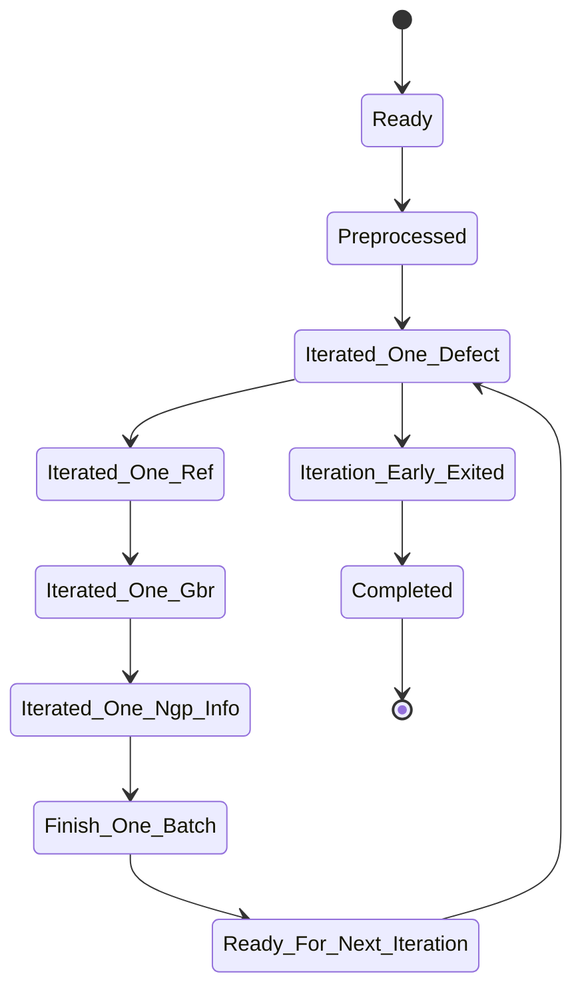

# States



# Usage

## Create a new adapter

You can convert an exist data-processing class into an adapter or create a new adapter in two ways:

- Create the new adapter directly inside release/mod/ directory.
  - Pros: No new package creation needed.
  - Cons: You need to register the module to the plugin manager.
- Create a new adapter package.
  - Pros: Once the package is installed through "pip install", the plugin manager would discover it and automatically register the module, and you need not change the code base of release.
  - Cons: A few lines of additional code in setup.py is needed.

### Complete the adapter

Inherit basic adapter logics from release.interface.AbstractAdapter and implement the following missing parts:

- **Required** property defect_data_iterator

  ​	Here defines how to iterate the original defect image of the current index.

- **Required** methods preprocess() and after_preprocess()

  - preprocess() defines what should be done **before** each iteration, usually the pre-processing. 
  - after_preprocess() defines the post-handling after preprocess() being called, usually **the error handling**; if errors occurred in preprocess(), a self._fail() call is needed here to change the state into failure.

- Optional property ref_data_iterator

  ​	If skip_ref_data is not false, here defines how to iterate the reference image of the current index.

- Optional property gbr_data_iterator

  ​	If skip_gbr_data is not false, here defines how to iterate the Geber image of the current index.

- Optional property ngp_info_data_iterator

  ​	If skip_ngp_info_data is not false, here defines how to iterate information such as the Not-good-point coordinates of the current index.

- Optional methods before_gather_one_batch_data()

  ​	Here defines what to do just before yielding the current batch of data in the res_iter.

- Optional methods after_each_batch()

  ​	Here defines what to do when the current batch of data is yielded.

- Optinal method after_finish() and after_failed()

  - after_finish() 

    ​	Here, one can define what to do when every iteration is successful.

  - after_failed()

    ​	Here, one can define what to do if any iteration fails.

### Implement the plugin interface

Implement the following plugin interface
```python
  def get_adapter(name:str, ctx:dict) -> AbstractAdapter:
    """Plugin hook for getting the adapter

    Args:
        name (str): The name of adapter mod the user requested
        ctx (dict): Arguments that the user type in
    Return:
        A class implements AbstractAdapter
    """
```

### To Create the new adapter directly inside release/mod/ directory

1. Add the new module to release/mod/ directory.
2. Register the new module at get_plugin_manager() in release/cli.py.

### To Create the new adapter as a package

1. Create a setup.py at the root directory of the package.

2. Define the entrypoint for your distribution as following:

   ```python
   from setuptools import setup
   
   setup(
       name="myproject",
       install_requires="release",
     	# release looks up the "release" entrypoint to discover its plugins
       # You can make your plugin available by defining it in your setuptools-invocation
       entry_points={"release": ["name_of_plugin = myproject.pluginmodule"]},
       py_modules=["myproject.pluginmodule"],
   )
   ```

## Example 

Make sure the release is installed correctly and you can import it.

The directory structure of a minimal setup for adapter package is like the following:

```
lk_adapter_mod_ut_data_adapter/
├── setup.py
└── ut_data_adapter.py
```

The ut_data_adapter.py has the following code:

```python
from release import hookimpl
from release.interface import AbstractAdapter
from numpy import random
class Example(AbstractAdapter):
    skip_ref_data = True
    skip_gbr_data = True
    skip_ngp_info_data = True
    
    def __init__(self, x, y):
        print("Inited")       
    
    def preprocess(self):
        print("Preprocessing")

    def after_preprocess(self):
        print("Preprocessed")

    @property
    def defect_data_iterator(self):
        for i in range(10):
            yield random.random((50,50))

@hookimpl
def get_adapter(name: str, ctx: dict):
    if name == "ut_data_adapter":
        return Example(**ctx)
        
```

The setup.py is like:

```python
from setuptools import setup

setup(
    name="lk_adapter_mod_ut_data_adapter",
    install_requires="release",
    entry_points={"release": ["ut_data_adapter = ut_data_adapter"]},
    py_modules=["ut_data_adapter"],
)

```

At the root of lk_adapter_mod_ut_data_adapter directory, execute ```pip install -e .```

We can now easily use this plugin adapter:

```python
from release.cli import adapt

adapter = adapt('{
	"x": "hello",
	"y": "world",
}', 'ut_data_adapter')
for current_index, current_defect_img, current_reference_img, current_geber_img, current_ngp_info_dict in adapter.res_iter:
    print(current_index, current_defect_img, current_reference_img, current_geber_img, current_ngp_info_dict)
```

